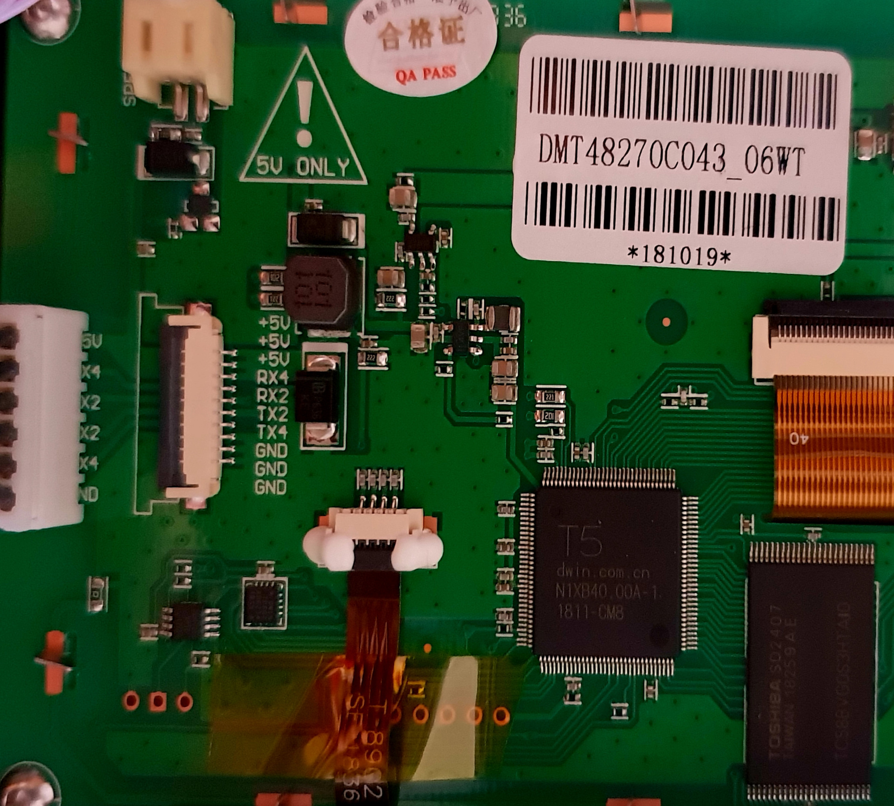

# DWIN LCD CR-10s Pro source

This project aims to recreate missing project file and configuration options needed to rebuild the DWIN firmware for the CR-10s Pro printer.

Currently the DWIN LCD firmware project is based on 1.60.3, but those can be easiliy updated to the latest version (right now I'm still using 1.60.3)

__EXPERIMENTAL!!! NOT SAFE FOR UPDATE!!!__

## Required steps to recreate the missing files

- Extract the Screen firmware to a new directory
- Copy the firmware/CR10sPro_1.60.3/DWprj.hmi at the same level where the DWIN_SET is.
    This file was manually recreated by hand. It has two sections INIT and IMG. The INIT settings are based on other project, but might be completely wrong! Those settings could be added/edited via the DGUS GUI.
    The IMG section is just the list of all images/pages. The index on the left is taken from the image name. Those should be verified one by one.
- Copy CONFIG.txt from firmware/CR10sPro_1.60.3/DWIN_SET/CONFIG.txt at the same directory.
    This file was also manually reacreated and might contain wrong parameters. More information about those configuration options you can read form "2.2 DGUS Parameter Configuration", tools/EN_DWIN DGUS Display Development Guide_V4.3.pdf
    Another help might come from the demo projects provided by DWIN: tools/Demo Projects T5LASIC_DGUSII_Part1.zip and tools/Demo Projects T5LASIC_DGUSII_Part2.zip
    Hint: This file might not be needed or the defaults might be OK. However setting wrong configuration options might break the communication between the motherboard (printer) and the LCD screen (like header, enabling checksum or baudrate).
- Extract tools/DGUS_V754.rar (you need Windows machine) and run the DGUS Tool V7.54.exe
- From the GUI open the project file firmware/CR10sPro_1.60.3/DWprj.hmi
- Click on Import button and select the DWIN_SET directory (that will load the 13xxx.bin and 14xxx.bin - touch and display variables)
- Now going from image (page) to image (page) you can see both touch and display fields. To select only Touch or Display variables, you have to select that from the select menu on the right (top-right) panel. You can modify those field by using the same properties panel on the right.
- Save, Generate, Export.
    You can export settings, project and generate the missing TFT directory.

## Open questions

- Make sure the DWprj.hmi is correctly recreated, including the INIT section
- Confirm that the CONFIG.txt is needed and correctly set
- Visually inspect that each page/image that is correctly linked to correct page/image (like Back button goes to correct page/image). That is especially importatant for the the SP (Stack pointer, default setting is 0xFFFF (set by Config. file)) and VP (Variable pointer, 0x0000-0x6FFF. Write 0x0000 for the variables that do not need address assigning. The command will be disabled when the high byte is 0xFF). See "4.4 VP & SP" section of the tools/EN_DGUS V5.10 User Guide.pdf

## Contribution

Any contribution to the project is welcome. From verifying the project and configuration files, filling-in the gaps or fixing bugs to testing in on spare DWIN LCD screen (DMT48270C043_06WT (T5UID1)). Once this project is confirmed to properly work on real hardware we can start using it to add extra features or at least fixing bugs.

